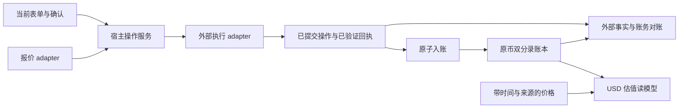

# ADR：固定换算、市场执行与原币账本的边界

日期：26-10-10。状态：扩展设计，等待首个真实 venue 集成按下述验收落地。本文不新增 Go API、数据库表或依赖，不表示已有 live swap 实现。

审阅基线：`97e33362abd436c072114ab863079ac65a78fad1`。输入为 [架构审查](../audits/2026-10-10-architecture-review/README.md)、[库消费审查](../audits/2026-10-10-architecture-review/library.md) 及既有 [RateQuoter 决策](../plans/2026-09-07-rate-quoter-and-exchange.md)。输出是宿主集成边界与验收场景；实现交接给宿主 backend，账本维护者审查入账契约；本 ADR 的核验记录见 [第 16 轮报告](../plans/iteration-reports/16.md)。未出现新的全局规则需求，Memory 为 no-op。

26-10-10 接入文档同步：保留上述审阅基线，以下当前保证已同步 Ledger20 的 available Exchange 校验、Capture 与估值示例；外部市场执行仍为待实施设计。

## 决策与当前保证

继续用 Currency 表示可互换、可计量单位，用 Classification 表示权属与余额用途。每种 Currency 保留原始数量并独立借贷平衡。兑换连接两种货币的账务腿，USD 只作为可选估值基准，不要求 A→B 实际经过 USD。TigerBeetle 的官方兑换示例同样使用各自币种内的账户转移，并把两腿原子关联；这是对建模边界的参照，不是更换本项目引擎的建议。[官方兑换建模](https://docs.tigerbeetle.com/coding/recipes/currency-exchange/)

| 层 | 当前实现与保证 | 本 ADR 的扩展约束 |
|---|---|---|
| 原币账本 | Journal 按 currency 平衡，记录原始数量；历史更正通过 reversal | 对外成交事实仍按原币入账；不能用 USD 差额抵消 BTC、USDC 等数量差额 |
| 固定换算 | `core.FixedRate` 有方向、版本和舍入；`ConversionQuote` 校验自身算术；`RateQuoter` 仅接收币对 | 保持小接口。汇率存储归宿主；不增加 rates 表或汇率管理 UI |
| 内部兑换 | `Service.Exchange` 消费已解析的 FixedRate；同事务完成 reserve、settle 和两条 journal；同 key 改 quote 冲突 | 继续服务内部钱包固定兑换；不把它改名或包装为已经完成外部成交 |
| 市场报价 | 当前没有数量相关报价接口 | 先在宿主消费方定义契约，再接官方 adapter；出现第二个真实消费者后再判断是否抽成可选模块 |
| 外部执行 | 当前 Exchange 不调用 venue、不广播链上交易 | 宿主负责提交、回执、最终性、已提交操作恢复；数据库事务之外执行 |
| USD valuation | [valuation 示例](../../examples/valuation) 展示保留原币数量的宿主读模型；不是 core 估值 API | 返回估值时点、价格来源、有效性和覆盖范围；不能据此授予兑换或提现权 |

当前源码依据为 [fixed_rate.go](../../core/fixed_rate.go)、[conversion.go](../../core/conversion.go)、[exchange.go](../../exchange.go)。单个 `ConversionQuote.Validate` 不校验 journal 真正移动了哪些金额；Exchange 检查 source / target 腿的 available 净变化分别为 `-Quantity` / `+Quote.TargetAmount`，其他用户分类各自净变化必须为零，不能用 pending、locked、memo 抵消错误的 available 数量或互相搬移。每腿仅能触及该币种及 holder / 系统对手方。`FundingUID` 核验引用 journal 存在、包含同 holder 的 source currency entry，但不证明一笔充值只被兑换一次、金额尚未被使用或该 entry 必然增加余额；这些业务约束由宿主维护。

`Settle` 只处理 reservation，不生成扣账分录。现有 Go-only `Service.Capture` 原子组合 settlement 与扣账，拒绝任何用户非 available 分录；用法见 [credits-topup](../../examples/credits-topup)。Capture / Exchange 加入调用者 `RunInTx` 时，错误必须向 callback 外传播；没有隐式 savepoint。普通事务入账为 `AuthStatusUnsignedTxMode`。需要 signed journal 时，沿用 [signed-capture](../../examples/signed-capture) 的交易外授权/验证与交易内 `PostAuthorized` 组合；unsigned discharge 仍让 verified reserve 保守保留原 hold 至到期，不能解释为完整 signed 资金生命周期或 Exchange 已支持 signed 组合。

## 五个职责与交接数据



以下是**宿主需要冻结的语义字段**，不是本仓库现有导出类型、HTTP 路径或可直接调用的 API。实施前将它们写成宿主消费方的类型和机器可校验 schema，再由 adapter 映射官方协议；不在 core 引入 HTTP、RPC 或 venue SDK。

| 交接 | 必要内容与判定 |
|---|---|
| 估值请求/结果 | Currency UID、原币数量、USD 单价、`as_of`、来源、价格版本、有效/过期/缺失状态。缺价项保留原币数量；总额标明不完整，不能把缺价当 0。展示价不承诺流动性或赎回资格 |
| 数量相关报价请求 | source/target 的完整资产身份、输入或输出定额模式、数量、链与执行账户、收款人、允许 venue/route、滑点/费用约束。所有改变成交结果的输入都绑定到本次报价 |
| 报价结果 | quote 标识、请求摘要、预计输入/输出、exact-in 的最小净输出或 exact-out 的最大总输入、费用明细及币种、生成/失效时刻、venue 与 adapter 版本；分清 gross 与 net，估计 gas 不当作已发生费用 |
| 提交记录 | 宿主 operation 标识、确认范围、绑定报价证据、reservation 或提交占用关联、可查询的外部身份、提交阶段。每次外部效果有稳定身份；超时后的检查不会生成一笔新的交易 |
| 已验证成交回执 | operation 与 venue 身份、chain/资产/收款人、实际输入和净输出、各币种实际费用、稳定 execution/fill 标识、区块/最终性证据、观察时刻和原始证据摘要。回执来自宿主可信 adapter，不接受浏览器自报成交成功 |
| 入账结果 | operation/receipt 与 journal UID 集合的不可重复绑定、所用会计映射版本、成功或待处理状态。外部证据与账务结果可以双向追溯 |

Uniswap 的官方 quote 请求包含金额、exact-input/exact-output、token/chain 和滑点参数；响应包含 route、输出下限和费用相关字段。这说明“一个币对一个单价”不足以表达市场报价。部分费用字段独立于 quoted amount，adapter 必须按所用 route 的真实语义计算净额，不能统一扣两次或漏扣。[Quote API](https://developers.uniswap.org/docs/api-reference/aggregator_quote)

Token 的 symbol 不是链上身份。adapter 以 chain + contract/native 标识映射 Currency UID；是否跨链合并为同一 Currency 取决于宿主托管与对账边界。不可互换礼物实例、批次到期、积分赎回资格仍由宿主模型表达；“完成任务发积分”没有来源货币，应使用 grant 模板，不伪装成 swap。

## 提交边界与状态

下面是宿主建议状态机；当前仓库没有这些市场执行状态。即时表单输入与未提交报价仅存在当前操作内存中，不提供持久保存、恢复或稍后继续执行的草稿。离开后重新发起并重新报价。用户确认当下有效报价后，服务才创建本次已提交操作记录；该记录是追踪已接受操作的生命周期，不是可以重新打开执行的草稿。

| 状态 | 持久性与允许动作 | 转移条件 |
|---|---|---|
| 当前报价（未提交） | 不持久恢复；可编辑与重新报价 | 账户、网络、数量或收款人改变则失效；提交前校验当前余额、权限、报价与签名有效期 |
| `accepted` | 已接收用户本次提交，持久保存 operation 身份与证据；短事务建立资金占用 | 占用失败则拒绝；成功后离开 DB 事务，再次检查有效期才可执行 |
| `submission_unknown` | 记录已进入可能产生外部效果的边界；只按稳定身份查询或按协议重播同一效果 | 得到明确外部状态才进入 pending、confirmed 或 failed；不能因本地超时释放占用或重新下单 |
| `pending` | 外部已接受，跟踪回执/最终性 | 达到宿主最终性策略→`confirmed_unposted`；有“不能再成交”的权威证据→`failed` |
| `confirmed_unposted` | 成交已发生；允许重复投递同一回执、重试本地入账 | 原子入账成功→`posted`；证据冲突/会计映射失败→`reconciliation_required` |
| `posted` | 返回原 journal 集合；相同回执重放不增加余额 | 后续重组或更正触发对账处理，不改写旧 journal |
| `failed` | 明确未成交；按已发生费用入账并解除剩余占用 | 用户若要再交易，创建新提交并使用新报价；不得自动恢复旧报价执行 |
| `reconciliation_required` | 保留证据、资金占用及差异，停止自动释放/重复执行 | 依据补充证据重试入账，或追加 reversal/补偿分录；需要新外部交易的补偿须有独立当前授权 |

为消除“已广播但尚未存 hash”的崩溃窗口，adapter 必须在外部调用前持久化可查询身份：例如已经确认提交的交易 hash/nonce 与广播证据，或 venue 支持的 client order ID。广播超时后只重播同一签名交易或查询同一订单，且须符合该 venue 的幂等保证；不推定所有 venue 都有幂等提交。没有可验证去重与状态查询的 adapter 不进入自动执行路径。若重启时仍能证明从未提交、且报价已过期，应终止该操作并解除占用；不能拿旧记录继续执行。

普通 reservation 的 TTL 不是外部成交最终性的期限。当前 Reserve 默认会过期，不能直接把它当作长期 pending swap 的完整保障。实施方必须先证明提交后资金占用不会被过期 worker 提前释放：可通过已配置的提交中分类及对应原子分录表达，或另行设计有回归测试的占用生命周期。`pending` 与未知提交都不能只按 TTL 自动返还可花余额。建账时区分“预占”“真正移出原币资产”“成交记账”，不得把前期迁入 pending 与最终扣款记成两次支出。

报价刷新、交易 deadline 和链上最终性是三种不同时间。Uniswap 官方 FAQ 建议用较新的 quote，并说明交易 deadline 的独立作用；宿主应根据所选协议校验时间，不把某个示例时长写成所有 venue 的通用保证。[官方 FAQ](https://developers.uniswap.org/docs/trading/swapping-api/faqs)

## 入账与失败矩阵

最终分录使用**实际成交数量与费用**。不能为了复用 FixedRate 而将 `实际输出 / 实际输入` 截断成单价，再乘回去重算输出；循环小数会改变已发生事实。`conversion_quotes` 仍遵守既有固定换算 schema，不把市场回执塞进该保留键冒充固定换算。市场成交证据保存在宿主操作记录，journal 关联稳定 operation/receipt 标识；未来若需要公开的 receipt metadata，应另行版本化契约。

本地入账在一个 `RunInTx` 中完成各币种分录、占用结清、宿主 receipt→journals 绑定与 operation 状态更新；所有写者按统一锁序。费用按各自 Currency 单独记账，手续费归属由会计配置明确。若宿主状态在另一个数据库，应使用 durable inbox/outbox 加幂等关联与对账，不宣称跨库原子性。成交回执不能因入账失败而丢弃。

| 故障/变化 | 必须保留的事实 | 处理与不能做的动作 |
|---|---|---|
| 提交前报价过期、账户/链/金额变化 | 尚未产生外部效果 | 拒绝执行并重新报价确认；不重放旧签名 |
| 建立占用失败 | 未提交外部执行 | 本地事务回滚；不调用 venue |
| 外部调用超时或进程在广播后崩溃 | 结果未知，稳定提交身份存在 | 进入 `submission_unknown`，查询/去重；不产生新订单，不按超时释放占用 |
| 明确 revert/拒绝且不可能后续成交 | 未发生 swap；gas 等费用仍可能发生 | 记录已发生费用，再释放未消费占用；新的尝试另行确认 |
| 部分成交或多 fill | 每个 fill 的真实数量与唯一身份 | adapter 若未实现部分成交则拒绝此类 route；支持时按 fill 去重，保留未完成部分占用，终态才释放余额 |
| 成交成功、本地事务失败 | 外部已经改变资产持有量 | 保留 `confirmed_unposted` 并重试**入账**；DB rollback 不回滚链上，也不能再次 swap |
| 回执/入账成功响应丢失 | 原 operation 与 journal 集合已存在 | 同身份同 payload 返回原结果；同身份改数量/币种/费用为冲突，进入对账 |
| 成交低于约定净输出或超出最大输入 | 已发生事实与授权约束不一致 | 标记差异并保留真实金额，不伪造约定金额“配平”；由宿主处理损失/补偿责任 |
| 记账后链重组或 venue 更正 | 原 journal 和原始观察仍存在 | 进入对账，追加关联 reversal/补偿及新证据；不 UPDATE/DELETE 历史分录 |
| USD 价格缺失/过期 | 原币余额仍有效 | 返回缺失/过期及覆盖范围；不篡改余额、不自动卖币补估值 |

账内借贷平衡和 `SolvencyCheck` 的 booked coverage 不能证明托管钱包/venue 有真实储备。宿主对账至少比较：已提交无最终状态、已成交未入账、已入账无有效外部成交、重复 fill、各币种数量与费用差异、托管账户真实资产与账面持仓。告警必须可定位到 operation、receipt 和 journals；“内部平衡”为绿不能掩盖这些差异。

## 两种集成实例

### 固定 USDC→CREDITS（当前可用）

宿主确认 1 USDC 充值后，按配置版本 `credits-v1` 定价 `1 USDC = 1000 CREDITS`。宿主在事务外获得 `FixedRate`，调用现有 `Service.Exchange`，传充值 journal 的 `FundingUID` 和稳定业务幂等键。成功后用户 USDC 减 1，CREDITS 加 1000；系统对应腿分别平衡，两条 journal 都保留相同换算证据。宿主若需标记“充值已兑换”，在同一 `RunInTx` 中更新自己的记录，并以业务唯一约束防止一次充值被不同 operation 重复处理。

重试使用该**已提交操作**原 rate/version/quantity，同 key 不再次移动余额；改价后的新购买使用新 key。这里没有 venue 下单。CREDITS 标价为 USD 或由 USD 换算展示，都不自动产生 CREDITS→USDC 的赎回承诺。现有 [credits-topup 示例](../../examples/credits-topup/main.go) 与 [Exchange 集成测试](../../exchange_test.go) 是实际实现证据。

### 同链 USDC→WETH 经真实 venue（后续宿主实现）

以下数值是验收夹具，不是实时报价。用户以 100 USDC 进行 exact-input swap；当前 quote 预计净得 `0.030 WETH`、最低净得 `0.0297 WETH`，gas 用 ETH 单独估计。宿主确认资产映射、账户、收款人和权限，建立提交记录及不会过早释放的资金占用，然后在 DB 事务外通过官方协议 adapter 执行。

最终回执确认实际消费 `100 USDC`、净收到 `0.0299 WETH`、另付 `0.0002 ETH` gas。入账使用这三个实际数量；账务配置明确 gas 是平台承担还是用户承担，不把它隐含进 WETH 汇率。宿主记录输入资产移出、输出资产移入及各自用户权属变化，系统 counterpart 对应清算/托管维度，确保每种币平衡且不重复扣除提交中的资金。

若链上成功而本地提交失败，后台继续查询该交易并投递同一已验证回执，直到本地 journals 原子提交；不得再次卖出 100 USDC。报价过期不影响这笔已成交交易的历史入账，补记账也不重新报价。若 pending 交易尚无确定结果，界面恢复其状态查询，不恢复为可再次点击执行的旧草稿。

此流程当前只有设计，没有 live adapter、receipt store 或端到端市场 swap 测试。首次落地只选明确的一条链、一类 exact-input route；接入前核验官方 SDK/API 发布来源、维护状态、链支持和版本兼容性，在宿主 composition root 装配，不为 ADR 预装依赖。

## 验收与推进门槛

当前固定兑换的可执行回归入口如下；需要可用的 PostgreSQL 测试环境，命令本身不证明外部成交能力。本轮只核对源码、测试名称与文档，不重跑资金测试。

```bash
go test ./core -run 'Test(FixedRate|ConversionQuote|ConversionQuotes|RateQuoter)' -count=1
go test . -run '^TestExchange_' -race -count=1 -timeout 5m
go test ./examples/credits-topup -run '^TestPurchase_' -race -count=1 -timeout 5m
```

市场 adapter 上线前必须新增并运行以下场景；**这些验收目前未实现、未运行，不计为通过**。测试用可控 venue 适配器模拟外部边界、真实 PostgreSQL 验证本地原子性，再针对选定官方 adapter 做 sandbox/测试链契约验证。

| 场景 | 可执行断言 |
|---|---|
| 同币对不同数量、exact-in/out、费用与资产身份变化 | 请求摘要不同；输出按对应报价；不能复用旧确认；同 symbol 异链/异地址不混用 |
| 过期报价、换账户、页面离开后重新进入 | 外部提交调用次数为 0；无可恢复待执行草稿；必须重新报价确认 |
| 每个崩溃点：占用前后、提交前后、回执存储前后、本地 commit 前后 | 重启后每个外部 execution 最多产生一次经济效果；未知结果可查；每个 receipt 仅一组账务分录 |
| 成功成交后注入一次数据库失败，再恢复重投 | 第一次无部分 journal/状态提交；重投后原币数量正确；venue 执行次数保持 1 |
| 相同回执重复/并发投递，与同身份变更 payload | 重复返回相同 journal UID 集合；改 payload 冲突且余额不变 |
| pending/unknown 跨过普通 reservation TTL | 可花余额不提前恢复；最终失败只释放剩余占用；最终成功不重复扣除 pending |
| 真实输入/净输出/gas 分属多个币种，且实际输出偏离估值 | 按 receipt 精确记账，每币种借贷平衡；费用只记一次；USD 估值不影响分录 |
| 重组、更正、部分成交和永久本地入账故障 | 不抹历史；差异持续可见；有明确重试/人工处置出口；不支持的 route 提交前拒绝 |
| 已提交操作恢复与多租户权限 | 原主体可查询原 receipt/journals；其他主体不能读取或重放；状态恢复不会产生新的执行授权 |

取舍：宿主会承担外部状态存储与对账，但 ledger 保持可嵌入、确定性的数量记账内核。只有两个实际集成证明共同契约稳定后，才把复用部分提取成独立可选模块；不提前构造通用交易引擎或远程事务 DSL。
