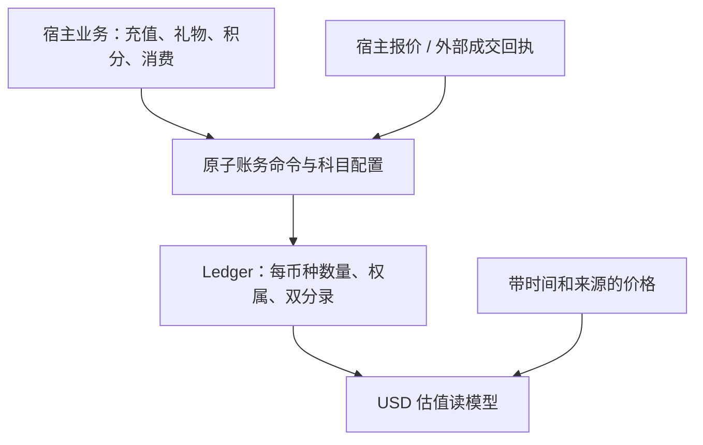

# 通用 Ledger 架构审查与迭代基线

基线 `d00fdebef4199d331787057127cc29a0ecb7cd87`，日期 2026-10-10。此报告记录修复前事实；修复状态由 [20 轮进度](../../plans/2026-10-10-ledger-20-progress.md) 跟踪。用户已授权实施、提交与推送。

## 结论

保留现有 Currency / Classification / Journal / Reservation 分层。按币种保持原始数量，USD 是可选估值基准；复式平衡、商业报价、外部执行是不同职责。核心已经可以被 Go 项目独立消费，React 包也通过独立 tarball 消费。无需替换引擎或强制所有兑换途经 USD。

## 已确认缺陷

| ID | 优先级 | 证据与后果 | 定位 |
|---|---|---|---|
| R1 | P1 | holder-wide frozen 按 policy ID 汇总不同币种；USD 减 100 与 PTS 加 100 抵消，冻结账户 USD 从 100 到 0；USD 单独扣减控制组被拒 | postgres/account_policy_enforce.go:60、92；probes/frozen-probe.log |
| R2 | P1 | 9007199254740993 经页面 parseInt / JSON number 变成 9007199254740992；记账对象变化 | library.md L-1、library-probes/output.txt |
| R3 | P2 | 同一 QueryClient 跨 backend 或 session 复用键，B 显示 A 的余额且无请求 B | library.md L-3 |
| R4 | P2 | Reserve / CreateBooking 在 Validate 之前调用 Amount.String；违反 I-70 在展开数值前校验的承诺。静态调用链核实，未跑巨大字符串压力 | postgres/reserver_store.go:162、booking_store.go:81 |
| R5 | P2 | client expires_in 被 Go handler 忽略，期望一小时变默认 15 分钟；真实 client→handler 复现 | library.md L-2 |
| R6 | P2 | Round / ConvertAt / Allocate 未约束目标 exponent；极大 exponent 在独立子进程中超时，普通 exponent=2 正常。高层 FixedRate 已有限制，不等同已证明 HTTP 可触发 | core/money.go:47、76、114；probes/money-probe.log |

probes 的 PASS 表示修复前缺陷被复现，不表示实现正确；修复必须另写拒绝缺陷输入的回归断言。R1 必须按 policy+currency 净额判断，同时保留同币 pending→available 的合法确认。

## 值得保留的设计

- 每币种独立借贷平衡、append-only journal、幂等键比较完整负载，以及 real PostgreSQL 集成测试。
- Currency 数量用 decimal/NUMERIC；FixedRate 有方向、版本、舍入，ConversionQuote 留存换算证据；汇率由宿主提供。
- Go facade、core ports、postgres adapter 和可选 server 分离；链与存储 SDK 放独立 module。
- RunInTx 能与宿主业务记录同事务；React headless / 两种 skin / server 入口已有真实消费检查。

## 边界与迭代方向

同币种内部迁移、无来源奖励发放和兑换应分别表达。可互换的礼物数量可用 Currency；独立礼物实例、批次到期、权益赎回资格在宿主层表达。USDC 在多条链上是否共享账本科目，应由托管和对账边界决定，不能仅按 symbol 合并。

Settle 只解除 hold，不记账，这是明确契约。应从现有 credits 示例抽取原子 Capture，减少宿主复制 settle+charge、锁排序、幂等绑定。交易内错误必须向上传播；RunInTx 没有隐式 savepoint。交易内普通 journal 是 unsigned，签名部署需要交易外 AuthorizeTemplate + 交易内 PostAuthorized，不能宣称方便的 Exchange 自动具备验签余额保证。

Exchange 两腿目前检查全部 role-bearing balance 的净变化；下一步应收窄为可用余额消费契约，防止可用币未扣却消费其他余额维度。市场 swap 的数量相关报价、费用、最小输出、有效期、执行回执属于更外层。数据库事务无法回滚链上成交；已提交操作恢复与对账必须保留，待提交金融草稿不持久恢复。

SolvencyCheck 是内部 booked coverage；不等同外部储备真实性。USD 估值不改变原币账本，缺价格须显式返回缺失，不能显示为零。

架构参照仅使用官方来源：[TigerBeetle currency exchange](https://docs.tigerbeetle.com/coding/recipes/currency-exchange/) 的分币种关联入账；[Uniswap quote API](https://developers.uniswap.org/docs/api-reference/aggregator_quote) 的数量相关报价。这些支持职责拆分，不构成更换库或引入新依赖的建议。

## 基线验证

root、core、presets、credits-topup race 测试通过（root 用本任务独立 PG17 重跑；首次 testcontainers 缺 5432 端口的启动失败记录在临时日志）；go vet ./... 通过。Go root ./... 不包含三个独立子 module。React 257 tests、build、typecheck、codegen、server short/race、Go 与 npm 独立消费通过，详见 library.md。

web npm audit 报 2 high / 1 critical，尚未分析可利用性，不能称发布安全闸全绿；已纳入单独迭代。报告不会把旧审计已修项、已明示取舍或未验证推断重复计成新缺陷。
